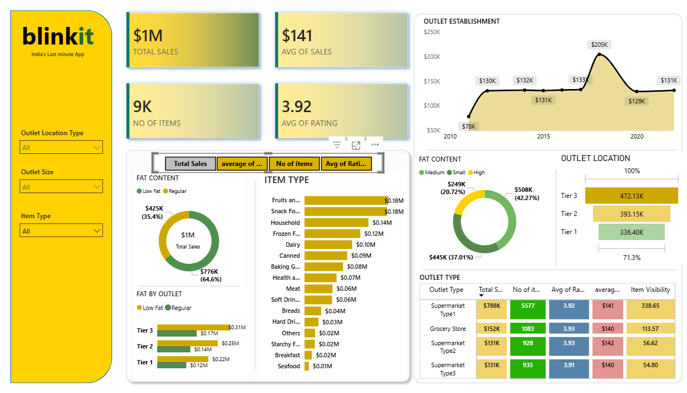

# Blinkit Sales Analysis Dashboard 📊

This project presents an interactive **Power BI dashboard** created to analyze Blinkit sales data and uncover key business insights.

## 🔍 Key Insights
- Total Sales: $1M+
- Average Sales: $141
- Number of Items: 9K
- Average Customer Rating: 3.92
- Highest sales from Tier 3 outlet locations
- Supermarket Type 1 contributes the highest revenue
- Regular fat content products dominate sales

## 📌 Dashboard Features
- Sales trend by outlet establishment year
- Item-wise sales analysis
- Outlet size and location performance
- Fat content contribution
- Interactive filters for outlet size, location, and item type

## 🛠 Tools Used
- Power BI
- Excel (Data Cleaning & Preparation)

## 📈 Business Impact
Helps stakeholders understand sales performance, customer preferences, and outlet efficiency for better decision-making.

## 📷 Dashboard Preview

---

⭐ If you like this project, feel free to star the repository!
